<div align="center">

<!-- Custom Animated Header -->


<!-- Dynamic Stats Banner -->


<!-- Animated Typing Effect -->


<!-- Advanced Performance Metrics -->
<table>
<tr>
<td>

</td>
<td>

```python
class FakeNewsDetector:
    def __init__(self):
        self.accuracy = 94.7
        self.speed = "1.8s"
        self.model = "NLP+ML"
    
    def detect(self, article):
        return "VERIFIED" if self.analyze(article) else "FAKE"
```

</td>
</tr>
</table>

<!-- Custom SVG Skills -->


</div>

---

## 🎯 PERFORMANCE MATRIX

<div align="center">

<!-- Advanced Metrics Visualization -->


<table>
<tr>
<td width="50%">

### 📊 MODEL PERFORMANCE
```javascript
const metrics = {
  accuracy: "94.7%",    // ████████████████████ 100%
  precision: "93.2%",   // ███████████████████▌ 98%
  recall: "95.1%",      // ████████████████████ 100%
  f1Score: "94.1%",     // ███████████████████▌ 98%
  speed: "1.8s",        // ⚡ Real-time processing
  dataset: "10K+ articles"
};
```

</td>
<td width="50%">

### 🧠 NLP PIPELINE

```mermaid
flowchart TD
    A[📰 Raw Article] --> B[🔤 Tokenization]
    B --> C[🌱 Stemming]
    C --> D[📊 TF-IDF]
    D --> E[🤖 Classification]
    E --> F{🎯 Result}
    F -->|Real| G[✅ Verified]
    F -->|Fake| H[❌ Detected]
    
    classDef input fill:#667eea,stroke:#333,stroke-width:2px,color:#fff
    classDef process fill:#764ba2,stroke:#333,stroke-width:2px,color:#fff
    classDef output fill:#f093fb,stroke:#333,stroke-width:2px,color:#fff
    
    class A input
    class B,C,D,E process
    class G,H output
```


</td>
</tr>
</table>

</div>

---

## ⚡ INSTALLATION & DEPLOYMENT

<div align="center">

<!-- Terminal Animation -->


<table>
<tr>
<td width="33%" align="center">

</td>
<td width="33%" align="center">

**🚀 Quick Deploy**
```bash
docker run -p 5000:5000 \
  fake-news-detector:latest
```

</td>
<td width="33%" align="center">

**☁️ Cloud Ready**
- AWS Lambda
- Google Cloud
- Azure Functions
- Heroku Deploy

</td>
</tr>
</table>

</div>

---

## 🛡️ LIVE DETECTION SYSTEM

<div align="center">

<!-- Real-time Activity Graph -->


<!-- Detection Interface Mockup -->
<table>
<tr>
<td width="60%">

### 🔍 DETECTION INTERFACE
```diff
INPUT: "Breaking: Scientists discover cure for aging"
+ PROCESSING: Text analysis initiated...
+ FEATURES: Extracting linguistic patterns...
+ MODEL: Running classification algorithm...
- RESULT: ❌ FAKE NEWS DETECTED (confidence: 87.3%)
! WARNING: Sensational claim without verification
```

</td>
<td width="40%">

### 📈 REAL-TIME STATS
| Metric | Value |
|--------|-------|
| 🎯 Accuracy | 94.7% |
| ⚡ Speed | 1.8s |
| 📰 Articles | 10,247 |
| 🛡️ Blocked | 2,156 |
| ✅ Verified | 8,091 |

</td>
</tr>
</table>

</div>

---

## 🎨 ARCHITECTURE & TECH STACK

<div align="center">

<!-- Technology Radar -->


<table>
<tr>
<td width="25%" align="center">

**🐍 Core Engine**
<br>

<br>


</td>
<td width="25%" align="center">

**🧠 NLP Stack**
<br>

<br>


</td>
<td width="25%" align="center">

**📊 Data Science**
<br>

<br>


</td>
<td width="25%" align="center">

**☁️ Deployment**
<br>

<br>


</td>
</tr>
</table>

<!-- Advanced System Architecture -->


</div>

---

## 🎥 INTERACTIVE DEMOS

<div align="center">

<table>
<tr>
<td width="33%" align="center">

<br>
Watch real-time detection
</td>
<td width="33%" align="center">

<br>
Interactive web interface
</td>
<td width="33%" align="center">

<br>
Download mobile version
</td>
</tr>
</table>

<!-- GitHub Activity -->


</div>

---

## 👨‍💻 CREATOR & CONTRIBUTIONS

<div align="center">

<!-- Profile Card -->


<table>
<tr>
<td align="center">

**🧠 Modassir Alam**
<br>
*AI Engineer • NLP Specialist • Truth Detector*

<br>

[](https://www.linkedin.com/in/alammodassir/)
[](https://github.com/alam025)
[](mailto:alammodassir025@gmail.com)

</td>
</tr>
</table>

<!-- Contribution Graph -->


</div>

---

<div align="center">

<!-- Animated Footer -->


</div>